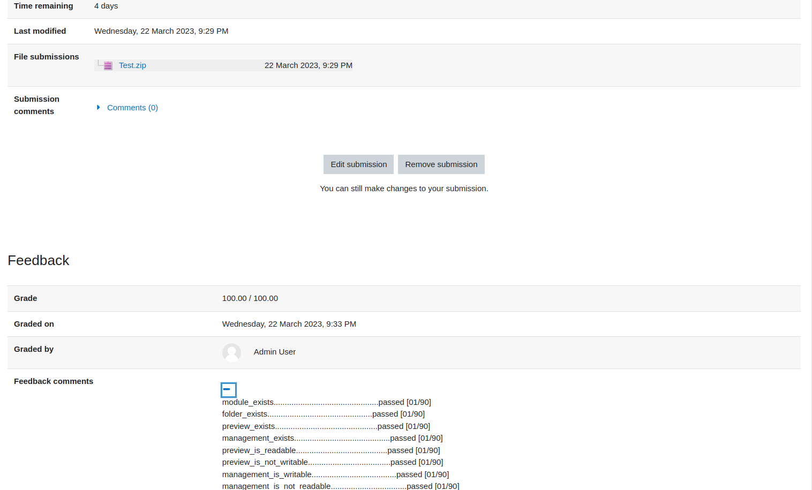
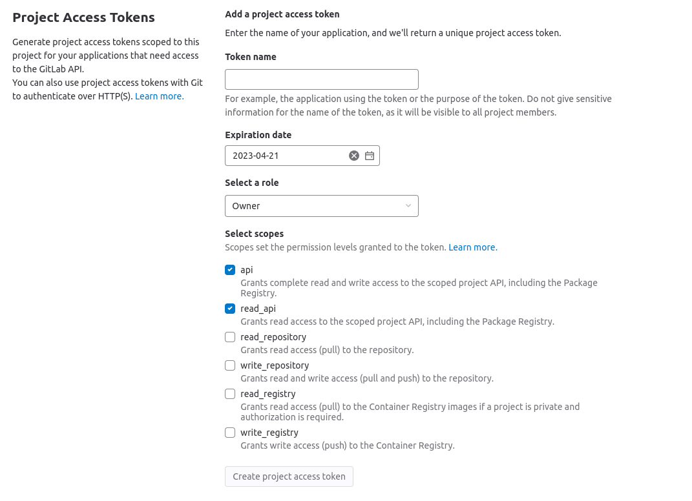
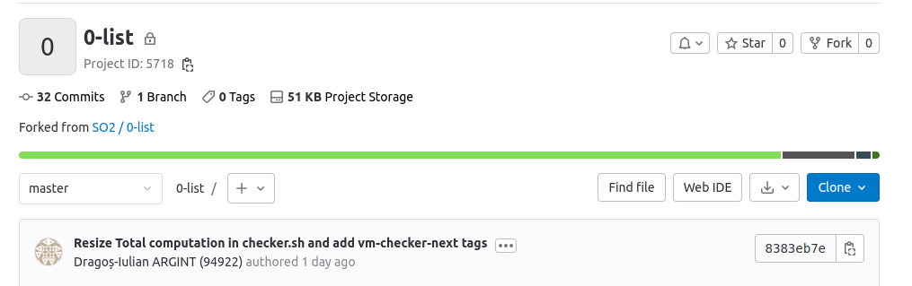
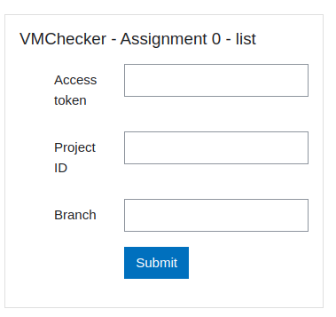

# Guide for using the test infrastructure

## Setup
1. Login into your gitlab accout using the UPB login at https://gitlab.cs.pub.ro/users/sign_in
2. Make a **private** fork of this repository.
In the right corner you can find the fork button.
After clicking it, the following should be prompted at you:


Select your user as the namespace for your fork.
And please make sure the visibility level is set to **Private**

3. Clone your repo locally
```
$ git clone <remote_of_your_private_fork>
```

## Working on the assignment
Start the assignment from the skeleton inside the `src/` directory.
The first option is to code in the `src/` and run the checker using the following command:
```
$ ./local.sh checker 0-list
```
This will start the docker, start the SO2 VM inside the docker and run the checher for you inside the VM.
If your run on Linux you can add the `--privileged` argument to the previous command and the checker will run with KVM support.

The second and recommended option is to connect to the docker interactively and then to the VM and run the checker manually.
1. Connect to the docker
```
$ ./local.sh docker interactive
```
If you use native Linux you can benefit from KVM superpowers using the `--privileged` argument.
Thus the container will be started in privileged mode and you have access to KVM.
After executing the last command you should get a prompter in the docker.
When running in interactive mode the `src/` directory is mounted to the `/linux/tools/labs/skels/assignments/0-list` directory inside the docker. The previous directory is shared with the VM as well in `skels/assignments/0-list`.
So any change in one  would affect the other.
**Be careful not to delete your code!**.
We encourage you to make as many commits as possible on your **private** gitlab repo!

2. Build your assignment:
```
# you should be in /linux/tools/labs inside the docker
$ make build
```

3. You can start the VM with the following command:
```
# you should be in /linux/tools/labs inside the docker
$ make console
```
After this command you should get a prompter inside the VM

4. Copy the `*.ko` into the `skels/assginments/0-list-checker` directory
```
# you should be in /home/root inside the VM
$ cd skels/assignments/0-list-checker
$ cp ../0-list/list.ko . 
```

5. Run the checker
```
# you should be in skels/assignments/0-list-checker inside the VM
sh _checker
```

## Submiting the assignment
### Option I
1. Create a `*.zip` archive containing all the source files and headers of your solution and a `Kbuild` file that results in the `list.ko` module.
2. Upload the archive on moodle in the section corresponding to the assignment.
3. After a few minutes, you can see the checker results on the submission page, like in the following image.


### Option II
The second option will automatically create the archive from your **private** repo on gitlab.
More precisely from the `src` directory of your repo.
1. From your **private** repo go to `Settings->Access Tokens`.
Generate a token that has `api` and `read_api` scopes and `owner` role.
Copy the token.


2. Take the project id of your **private** repo.


3. Fill in the form on moodle with the details and click `Submit`.

    

4. After that you can go to the assignment page and see the already created archive.
After a few minutes you will be able to see the feedback of the checker.

Find the complete procedure for using `vmchecker-next` [here](https://github.com/systems-cs-pub-ro/vmchecker-next/wiki/Student-Handbook)